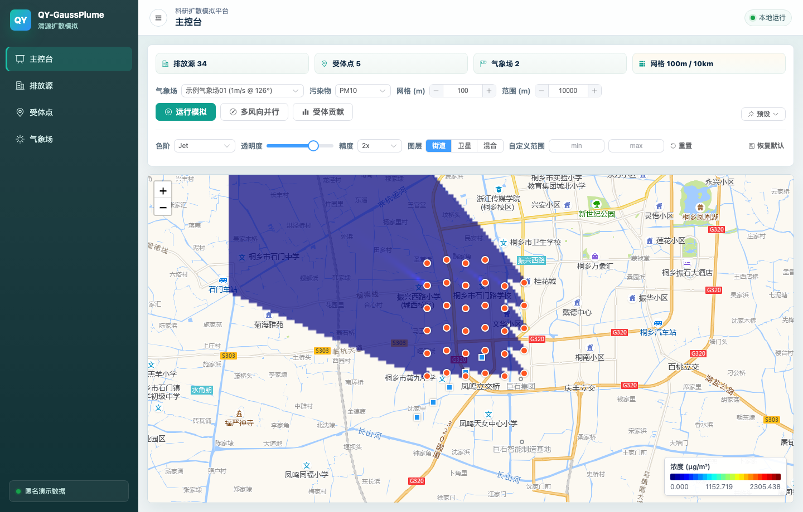
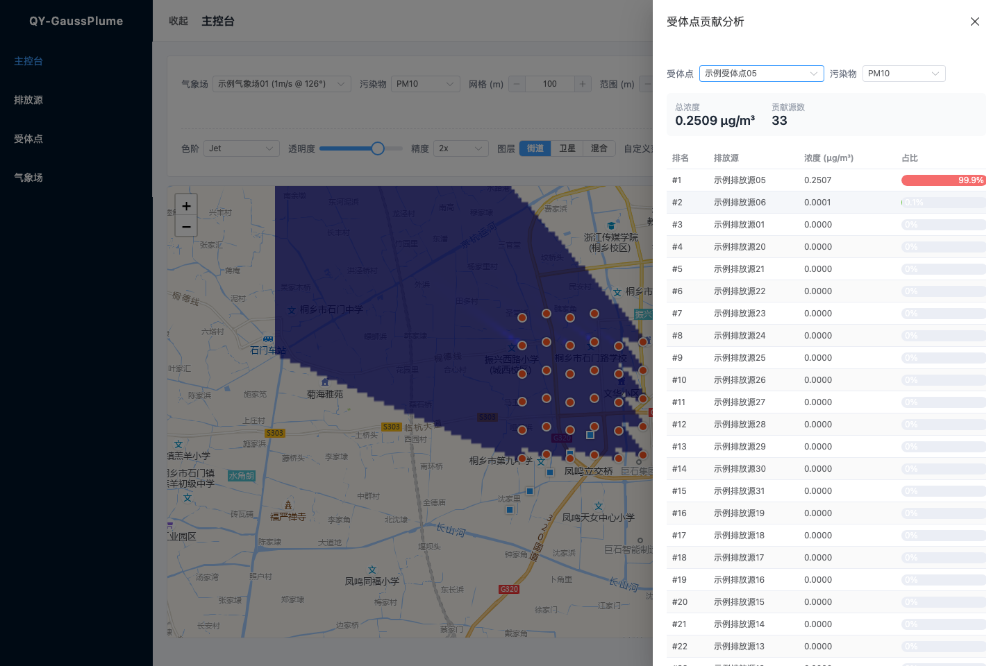
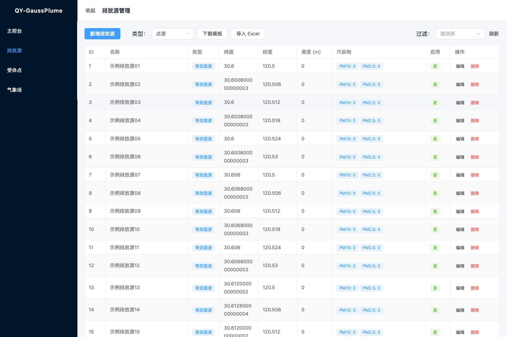
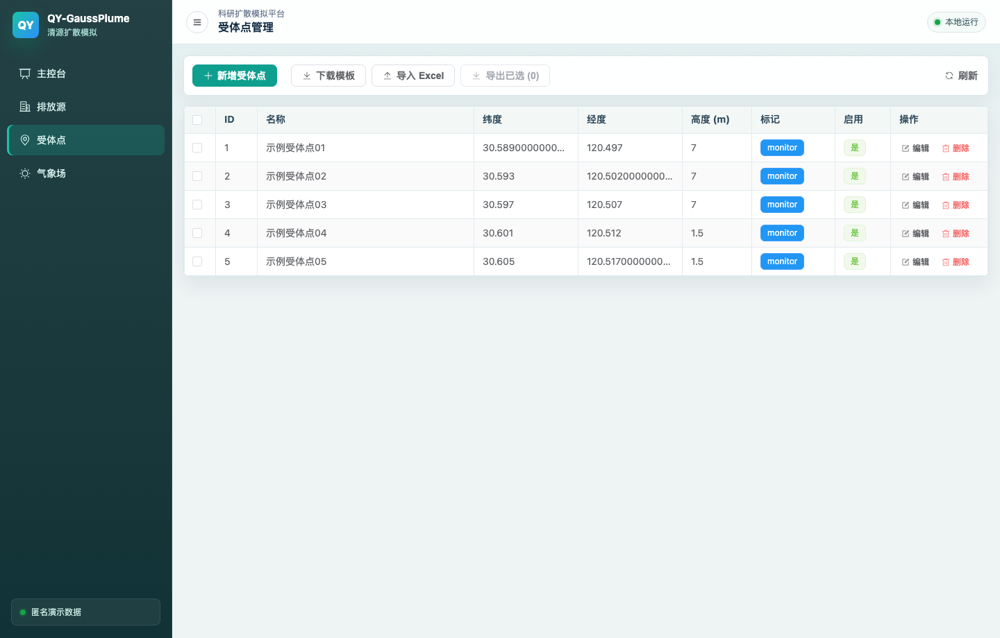
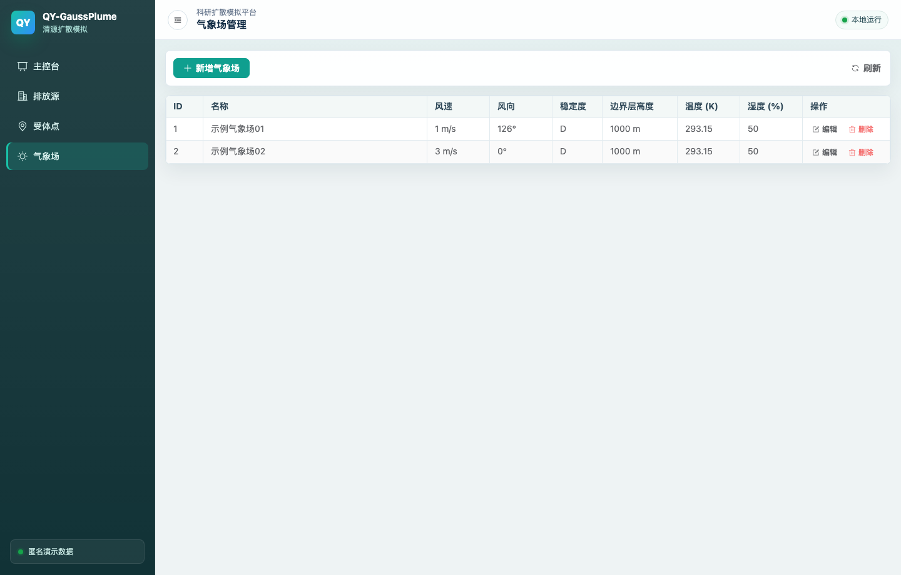

<!-- Translation status:
Source file: README.md
Source commit: (uncommitted)
Translated: 2026-06-03
Status: up-to-date
-->

> **Language**: [简体中文](README.md) · [English](README.en.md) · **日本語** · [繁體中文](README.zh-TW.md)

[](LICENSE)
[](backend-dotnet/)
[](frontend-vue/)
[](https://github.com/lordmos/meridian)

# QY-GaussPlume

QY-GaussPlume は、研究チーム、環境アセスメント担当者、工程評価担当者向けの大気汚染拡散シミュレーション基盤です。排出源、受容点、気象条件、地図可視化を 1 つの作業画面にまとめ、風況の違いによる拡散影響、受容点への寄与、工程案を素早く比較できます。

## Quick Start

```bash
git clone git@github.com:Zenine/qy-gaussplume.git
cd qy-gaussplume
./scripts/start.sh
```

<http://localhost:5173> を開きます。フロントエンドは `/api/*` を <http://localhost:5207> にプロキシします。

コミット前には完全な検証入口を実行してください。

```bash
./scripts/verify.sh
```

## Why It Matters

- 拡散評価をスクリプト試算から、地図上で操作できるワークフローに変えます。
- 点源、面源、線源、等価面源に対応し、現場でよく使うデータ形態を扱えます。
- 単一風向と重み付き多風向の並列シミュレーションに対応します。
- 各受容点について汚染源の寄与ランキングを出し、影響の由来を説明できます。
- 匿名化されたデモデータと完全な検証入口を備え、納品やレビューに使いやすい構成です。

## What You Can Do

- ダッシュボードで気象場、汚染物質、範囲、格子解像度を選択できます。
- 保存済み気象場を上書きせず、一時的な風速と風向で単一風向シミュレーションを実行できます。
- 地図上で矩形範囲を描き、範囲内の排出源と受容点だけを対象にできます。
- Excel テンプレートで排出源と受容点を一括インポートできます。
- PM2.5、PM10、TSP、VOCs、NOx、O3 の濃度場と寄与分析を確認できます。

## Screenshots

| ダッシュボードシミュレーション | 受容点寄与分析 |
|---|---|
|  |  |

| 排出源管理 | 受容点管理 | 気象場管理 |
|---|---|---|
|  |  |  |

## Architecture

```text
frontend-vue (Vue 3 + TypeScript + Leaflet)
        |
        | HTTP JSON /api/*
        v
backend-dotnet (ASP.NET Core 9)
        |
        +-- GnnSimulation.Core  ガウスプルームモデルと寄与分析
        +-- GnnSimulation.Data  EF Core + SQLite
        +-- Shapefile / Excel   地図境界と一括入出力
```

## Data And Privacy

`backend/air_pollution.db` は匿名化されたデモデータで、ローカル実行と機能説明のためだけに含まれています。実プロジェクト名、顧客データ、秘密情報、アカウント認証情報、未承認の監測データをコミットしないでください。

## Documentation

| ドキュメント | 内容 |
|---|---|
| [docs/ARCHITECTURE.md](docs/ARCHITECTURE.md) | レイヤ構成、データフロー、進化の記録 |
| [docs/API.md](docs/API.md) | API エンドポイント参照 |
| [docs/WORKFLOW.md](docs/WORKFLOW.md) | 開発手順、検証、注意点 |
| [backend-dotnet/README.md](backend-dotnet/README.md) | バックエンド構成、設定、テスト、技術判断 |
| [frontend-vue/README.md](frontend-vue/README.md) | フロントエンド構成、状態管理、座標、テスト |

## Verification

現在の検証スイートは、バックエンド xUnit 138 件、フロントエンド Vitest 71 件、型チェック付き本番ビルドで構成されています。

```bash
./scripts/verify.sh
```

## Version

現在のバージョンは 3.0.7 です。最新更新では、VitePress 上部ツール群の配置とホーム feature/本文間隔を修正しました。詳しくは [CHANGELOG.md](CHANGELOG.md) を参照してください。

## License

本プロジェクトは [MIT License](LICENSE) の下で提供されています。

<sub>Built with [Meridian](https://github.com/lordmos/meridian)</sub>
