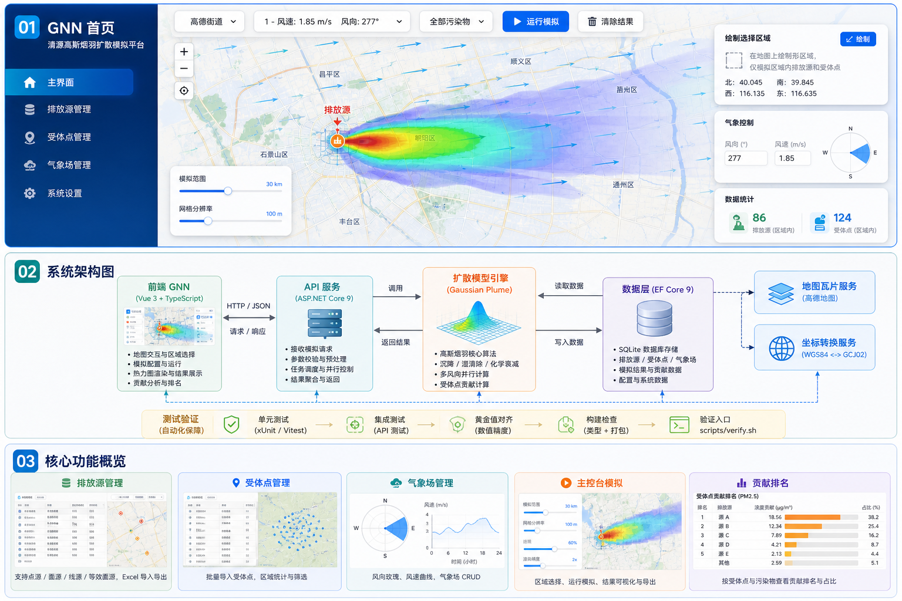
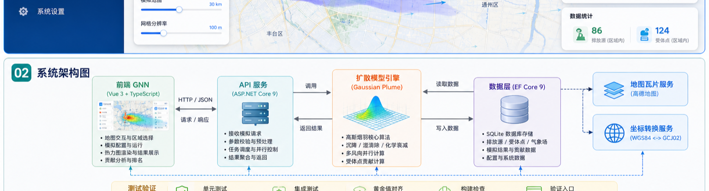
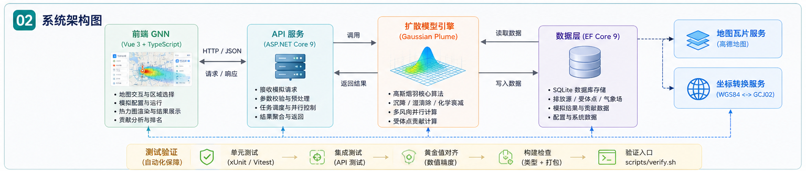
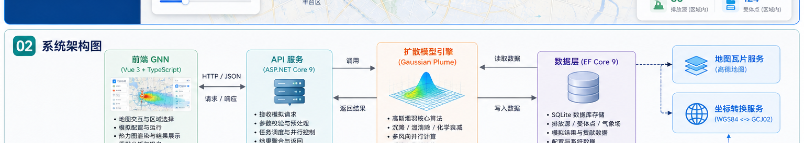
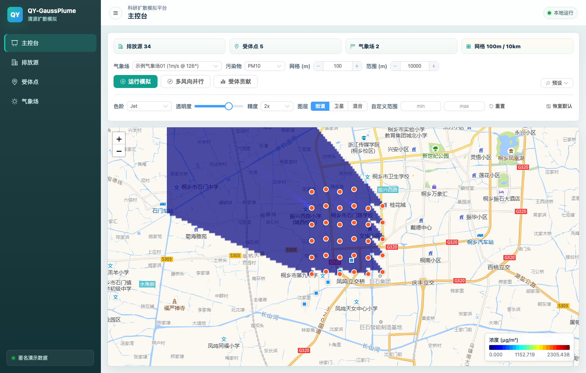
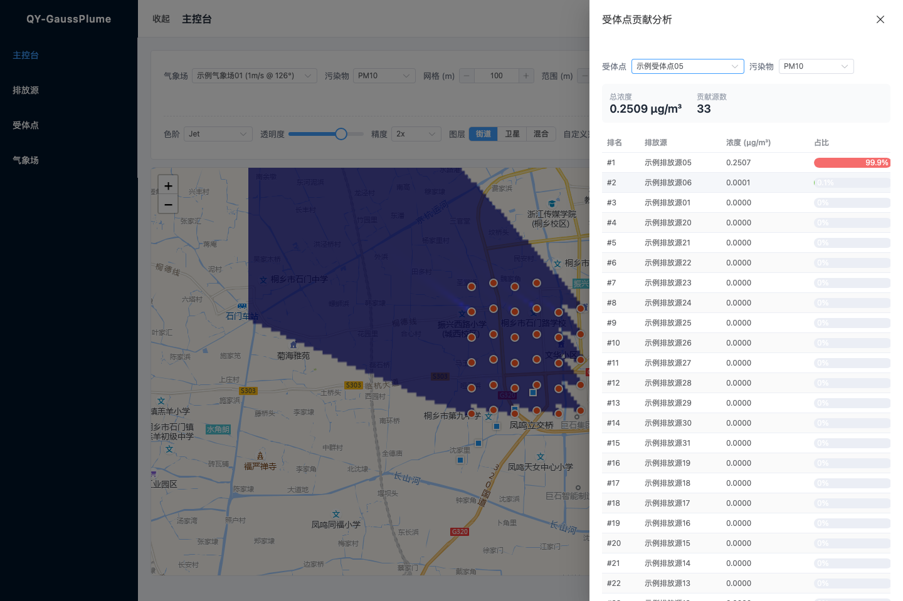
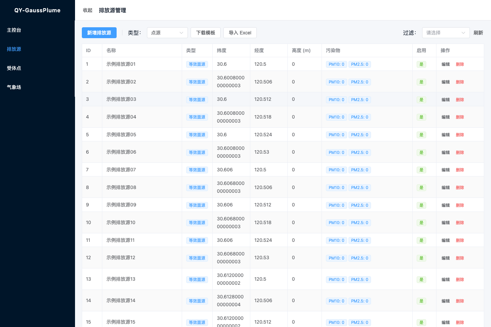
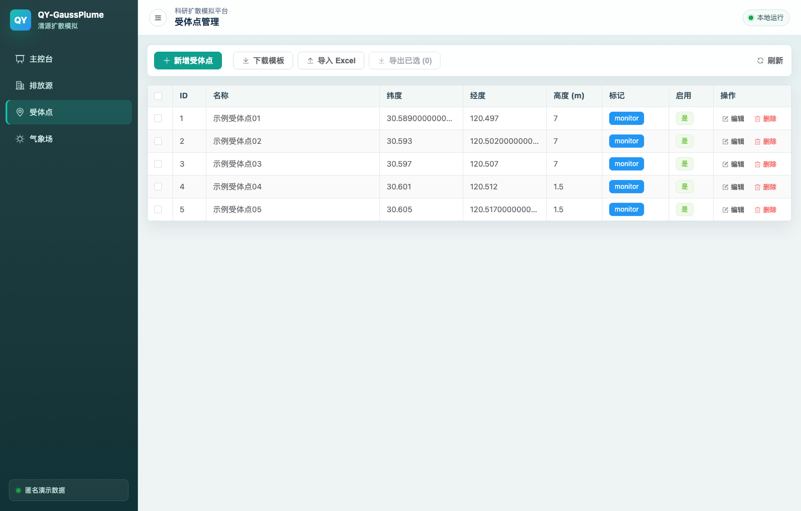
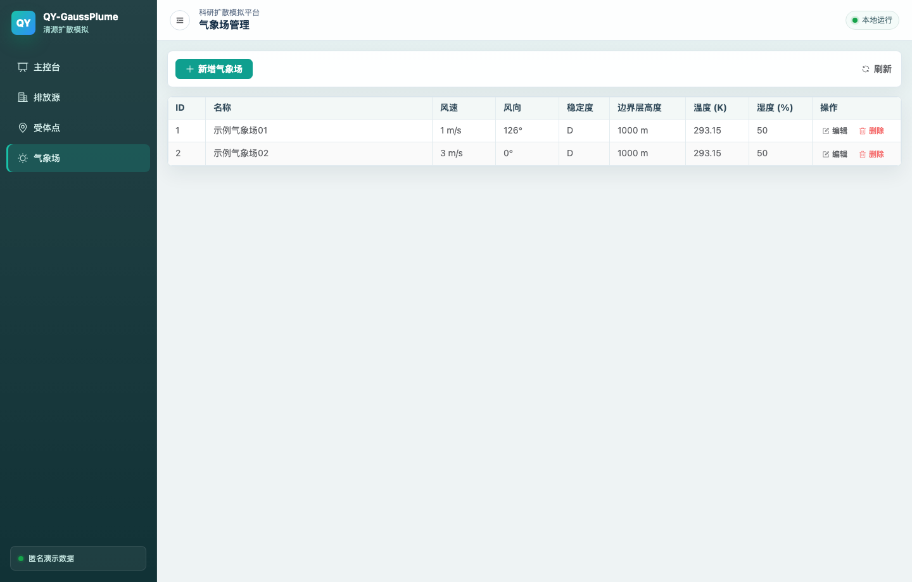

# QY-GaussPlume（清源高斯烟羽扩散模拟平台）

面向科研与工程评估场景的大气污染物扩散模拟平台。系统基于高斯烟羽模型，支持点源、面源、线源、等效面源，以及单风向和多风向加权并行模拟。

本项目用于清华长三角研究院等团队开展大气污染扩散、受体贡献分析和工程方案快速评估。当前运行实现为 **ASP.NET Core 9 + Vue 3**。

## 当前版本

| 项目 | 内容 |
|---|---|
| 版本 | **3.0.2** |
| 更新日期 | **2026-05-19** |
| 主要范围 | GNN 主控台、区域筛选、受体贡献摘要、核心注释与测试文档 |
| 验证结果 | 后端 137 个用例、前端 65 个用例，`scripts/verify.sh` 通过 |

## 本次修改说明

- **恢复 GNN 首页悬浮功能区**：顶部图层/气象场/污染物工具条、左下模拟范围与网格分辨率、右侧绘制区域、气象控制、数据统计、模拟结果和受体点贡献卡片均已回到主控台。
- **补齐区域模拟能力**：地图支持原生矩形框选，运行模拟时只提交区域内排放源与受体点；没有选中受体点时会保持空列表，不再误回退到全量受体点。
- **完善结果展示控制**：运行后可在首页调整色阶类型、浓度范围、透明度、渲染精度，并查看当前受体点的贡献排名摘要。
- **同步维护说明与测试**：关键算法、网格构建、风向聚合、地图渲染和框选流程补充中文维护注释；新增首页悬浮控件、区域筛选和空受体点请求回归测试。

## 项目介绍图

以下配图用于快速说明 GNN 首页、qy 后端架构和核心业务能力。图片由项目当前功能信息生成，已随文档入库，便于 README、汇报材料和交付说明复用。



| GNN 首页 Hero | qy 项目架构 | 核心功能介绍 |
|---|---|---|
|  |  |  |

## 功能概览

- **扩散模拟**：高斯烟羽模型，Pasquill-Gifford 扩散参数，Briggs 抬升，干沉降、湿清除和化学衰减。
- **源类型**：点源、面源、线源、等效面源。
- **污染物**：PM2.5、PM10、TSP、VOCs、NOx、O3。
- **并行计算**：支持 8 / 16 / 32 / 72 风向加权聚合，后端并行计算并可只返回聚合结果。
- **地图可视化**：Leaflet + 高德瓦片，WGS84 / GCJ02 自动转换，Canvas 浓度热力图。
- **区域模拟**：主控台可在地图上拖拽矩形区域，只模拟区域内排放源并统计区域内受体点。
- **数据管理**：排放源、受体点、气象场 CRUD，Excel 模板下载、导入和导出。
- **贡献分析**：按受体点和污染物查看污染源贡献排名与百分比，首页可快速查看当前受体点贡献摘要。

## 运行截图

以下截图基于仓库内匿名演示数据生成，可用于快速了解系统主流程和数据管理界面。

| 主控台模拟 | 受体点贡献分析 |
|---|---|
|  |  |

| 排放源管理 | 受体点管理 | 气象场管理 |
|---|---|---|
|  |  |  |

## 架构

```
┌──────────────────────────┐          ┌─────────────────────────────┐
│   frontend-vue (5173)    │          │   backend-dotnet (5207)     │
│                          │          │                             │
│  Vue 3 + TypeScript      │ HTTP/    │  ASP.NET Core 9             │
│  Element Plus + Pinia    │ JSON     │  EF Core 9 + SQLite         │
│  Leaflet + Canvas        │◀────────▶│  NetTopologySuite + ProjNet │
│  高德瓦片 + 坐标转换      │          │  ClosedXML + xUnit          │
└──────────────────────────┘          └─────────────────────────────┘
                                                    │
                                       ┌────────────┴────────────┐
                                       ▼                         ▼
                              backend/air_pollution.db    shp/县（等积投影）.shp
                              匿名演示 SQLite 数据库       县级边界 Shapefile
```

## 快速开始

### 环境要求

| 组件 | 版本 |
|---|---|
| .NET SDK | 9.0.x |
| Node.js | 20+ |
| 操作系统 | macOS / Linux / Windows |

### 安装依赖

```bash
# 如未安装 .NET SDK，可用官方安装脚本
curl -sSL https://dot.net/v1/dotnet-install.sh | bash -s -- --channel 9.0 --install-dir "$HOME/.dotnet"
export PATH="$HOME/.dotnet:$PATH"
export DOTNET_ROOT="$HOME/.dotnet"

# 安装前端依赖
cd frontend-vue
npm install --registry=https://registry.npmmirror.com
cd ..
```

### 启动开发环境

```bash
./scripts/start.sh
```

打开 <http://localhost:5173>。前端 Vite 会把 `/api/*` 代理到后端 <http://localhost:5207>。

停止服务：

```bash
./scripts/stop.sh
```

也可以分别手动启动：

```bash
cd backend-dotnet/GnnSimulation.Api && dotnet run
cd frontend-vue && npm run dev
```

## 验证

提交前请运行完整验证入口：

```bash
./scripts/verify.sh
```

该脚本会执行：

- 后端 xUnit 测试：`dotnet test`
- 前端 Vitest 测试：`npm test`
- 前端生产构建与类型检查：`npm run build`

也可以单独运行：

```bash
cd backend-dotnet && dotnet test --nologo
cd frontend-vue && npm test
cd frontend-vue && npm run build
```

当前测试规模：后端 137 个用例，前端 65 个用例，合计 202 个自动化测试。

## 目录结构

```
qy-gaussplume/
├── backend-dotnet/             # .NET 后端
│   ├── GnnSimulation.Api/      # ASP.NET Core Web API
│   ├── GnnSimulation.Core/     # 高斯烟羽核心算法
│   ├── GnnSimulation.Data/     # EF Core 实体、DbContext、迁移
│   ├── GnnSimulation.Tests/    # xUnit 测试
│   └── GnnSimulation.sln
├── frontend-vue/               # Vue 3 前端
│   ├── src/
│   └── tests/
├── backend/                    # 匿名演示 SQLite 数据库
├── shp/                        # 县级边界 Shapefile
├── docs/                       # 架构、API、开发工作流
├── scripts/                    # 起停与验证脚本
├── CHANGELOG.md
└── LICENSE
```

## 示例数据说明

仓库内的 `backend/air_pollution.db` 是匿名演示数据库，只用于本地运行和功能演示。公开仓库不得提交真实项目名称、真实客户数据、密钥、账号凭证或未获授权的监测数据。

如需使用院内或项目现场数据，建议放在仓库外部，并通过配置覆盖 `ConnectionStrings:Default`。

## 文档索引

| 文档 | 说明 |
|---|---|
| [backend-dotnet/README.md](backend-dotnet/README.md) | 后端结构、配置、测试与技术决策 |
| [frontend-vue/README.md](frontend-vue/README.md) | 前端结构、状态管理、坐标与测试 |
| [docs/ARCHITECTURE.md](docs/ARCHITECTURE.md) | 分层架构、数据流、演进说明 |
| [docs/API.md](docs/API.md) | API 端点参考 |
| [docs/WORKFLOW.md](docs/WORKFLOW.md) | 日常开发、验证、常见陷阱 |
| [CHANGELOG.md](CHANGELOG.md) | 版本与里程碑 |

## 参考

1. Pasquill, F. (1961). The estimation of the dispersion of windborne material.
2. Turner, D. B. (1994). Workbook of atmospheric dispersion estimates.
3. Briggs, G. A. (1975). Plume rise predictions.
4. HJ 2.2-2018 环境影响评价技术导则 大气环境。

## 许可证

本项目采用 [MIT License](LICENSE)。
