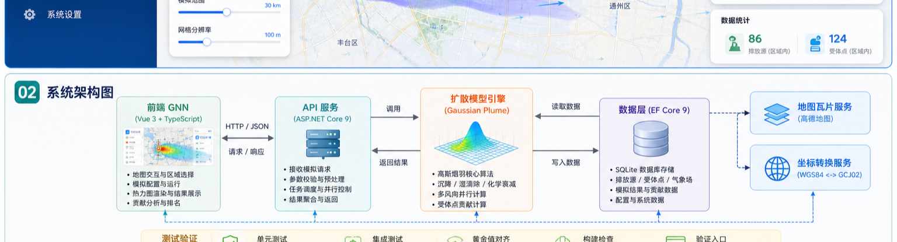
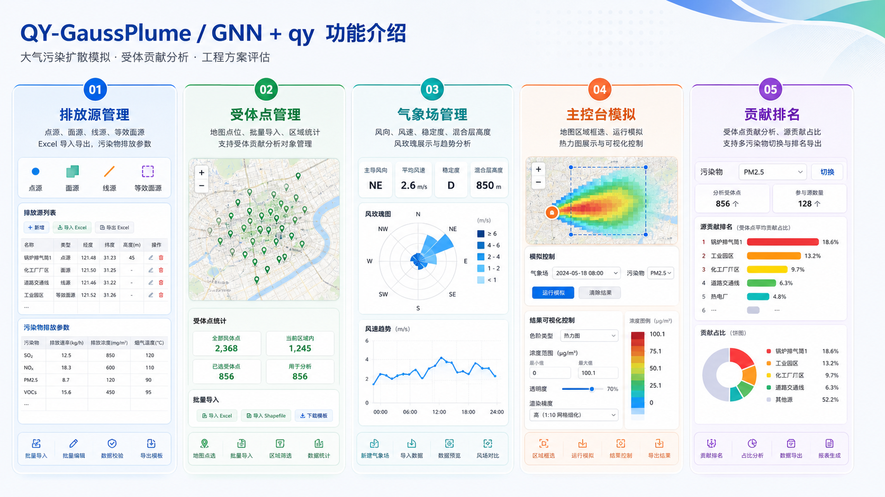

# QY-GaussPlume 前端

清源高斯烟羽扩散模拟平台前端。Vue 3 + TypeScript + Vite + Element Plus + Pinia + Vue Router + Leaflet。

## 当前版本

| 项目 | 内容 |
|---|---|
| 版本 | **3.0.9** |
| 更新日期 | **2026-07-14** |
| 主要范围 | 线源连续积分与地图语义、多风向权重校验、结果污染物筛选 |
| 验证结果 | Vitest 113 个用例，`npm run build` 通过 |

## 本次 GNN 修改说明

- **主控台气象控制生效**：风速、风向输入框会随单风向模拟请求提交为临时参数，运行模拟立即使用当前输入值，且不覆盖气象场管理中的保存值。
- **排放源等效面源输入修正**：等效面源只展示一个污染物数值框，保存到 `concentration`，列表展示同样读取 `concentration`，不再显示内部 `emissionRate=0`。
- **批量入口补齐**：排放源管理页明确提供批量导入和批量删除；受体点管理页提供批量导入、导出和批量删除；气象场管理页提供批量删除，批量删除部分失败时仍刷新列表。
- **选中状态清理**：排放源筛选或刷新、气象场刷新后会清空表格选中状态；关闭批量删除确认框不会误报失败。
- **公式说明可见**：主控台新增“公式说明”入口，`FormulaDrawer` 从 `/api/simulation/formulas` 拉取公式、源类型和污染因子参数，不在前端硬编码算法参数。
- **维护测试同步**：新增 Dashboard、Sources、Receptors、Meteorology 视图回归测试，覆盖上述行为。
- **依赖安全升级**：Axios 更新到 1.18.1，Vite 更新到 6.4.3，Vitest 更新到 4.1.10；生产依赖 `npm audit --omit=dev --audit-level=high` 为 0 漏洞。

## GNN 首页 Hero 图



这张图对应当前 GNN 主控台：地图为主画布，顶部工具条负责图层、气象场、本次计算污染物和模拟动作，左下角控制模拟范围、网格分辨率与模拟高度，右侧悬浮卡片承载区域绘制、气象控制、数据统计和运行后结果分析。结果卡与贡献排名里的污染物选择只切换已有结果展示；贡献排名按“空气站点 → 污染物指标 → 污染源”分组展示，不改变下一次计算请求。

## GNN 功能介绍图



功能介绍图覆盖当前前端五类核心入口：排放源管理、受体点管理、气象场管理、主控台模拟和贡献排名。后续如果首页控件或管理页流程继续变化，应同步更新此图和本 README 的版本说明。

## 快速开始

```bash
npm install --registry=https://registry.npmmirror.com   # 国内推荐
cp .env.example .env                                    # 如需改后端代理目标
npm run dev                                             # http://localhost:5173
```

前端通过 Vite dev proxy 把 `/api/*` 转发到 `VITE_API_PROXY_TARGET`（默认 `http://localhost:5207`）。先启动后端：

```bash
cd ../backend-dotnet && dotnet run --project GnnSimulation.Api
```

## 脚本

| 命令 | 作用 |
|---|---|
| `npm run dev` | Vite 开发服务器，热更新，`/api/*` 代理到后端 |
| `npm run build` | `vue-tsc -b`（类型检查） + `vite build`，输出 `dist/` |
| `npm run preview` | 预览生产构建 |
| `npm test` | Vitest 一次跑完全部 113 用例 |
| `npm run test:watch` | Vitest watch 模式 |

## 目录结构

```
frontend-vue/
├── vite.config.ts            # proxy /api → :5207；@ → src；vitest 配置
├── tsconfig.{app,node}.json
├── .env.example
├── src/
│   ├── main.ts               # createApp + Pinia + Router + ElementPlus (zh-CN)
│   ├── App.vue               # 侧边栏 + 顶栏 + router-view 布局
│   ├── router/index.ts       # 4 路由懒加载；afterEach 设 document.title
│   ├── stores/
│   │   ├── app.ts            # 侧边栏折叠
│   │   └── prefs.ts          # localStorage 持久化的用户偏好（色阶/透明度/...）
│   ├── types/index.ts        # 与 .NET DTO 一一对齐的 TS 类型
│   ├── api/
│   │   ├── client.ts         # axios 实例 + { detail } 透传到 error.message
│   │   ├── sources.ts receptors.ts meteorology.ts simulation.ts map.ts
│   │   └── index.ts
│   ├── views/
│   │   ├── DashboardView.vue # 主控台：地图悬浮工具条 + 框选 + 公式说明 + 结果/贡献卡 + 并行对话框
│   │   ├── SourcesView.vue   # 排放源 CRUD（含污染物子表、按类型动态字段、Excel 批量导入/批量删除）
│   │   ├── ReceptorsView.vue # 受体点 CRUD + Excel 批量导入/导出 + 批量删除
│   │   └── MeteorologyView.vue # 气象场 CRUD + 批量删除
│   ├── components/
│   │   ├── MapPanel.vue      # Leaflet 地图 + 高德瓦片 + 源/受体几何 + 热力图叠加
│   │   ├── ColorLegend.vue   # 色阶图例条
│   │   ├── ContributionPanel.vue    # 抽屉式受体贡献排名
│   │   ├── FormulaDrawer.vue        # 公式说明：后端公式、污染因子参数、源类型
│   │   └── ParallelSimulationDialog.vue  # 8/16/32/64/72 风向并行模拟
│   ├── composables/
│   │   └── useHeatmapRenderer.ts   # 双线性插值 + Canvas 渲染 + 4096 自动降级
│   └── utils/
│       ├── coords.ts         # WGS84 ↔ GCJ02 坐标转换
│       ├── colorScale.ts     # Jet / Turbo / Viridis / Grayscale
│       ├── selection.ts      # 矩形区域筛选
│       ├── download.ts       # blob 触发下载
│       └── error.ts
└── tests/
    ├── App.spec.ts           # 1：应用外壳、图标化导航、折叠按钮
    ├── api.spec.ts           # 13：所有 API 函数 URL/payload 正确
    ├── coords.spec.ts        # 6：国内外检测、加密偏移、往返亚米精度
    ├── colorScale.spec.ts    # 9：归一化、对数、四种色阶、范围扫描
    ├── heatmap.spec.ts       # 4：Canvas 尺寸、4096 自动降级、GCJ02 bounds
    ├── prefs.spec.ts         # 5：localStorage 持久化 / 恢复 / reset
    ├── selection.spec.ts     # 2：矩形范围命中与实体筛选
    ├── router.spec.ts store.spec.ts
    ├── components/           # ColorLegend、ContributionPanel、ParallelSimulationDialog
    └── views/                # DashboardView、SourcesView、ReceptorsView、MeteorologyView
```

## 关键技术点

### 与后端契约对齐

- **camelCase JSON**：ASP.NET Core 默认序列化约定，TS 类型按此镜像
- **`/api/{sources|receptors|meteorology|simulation|map|config}/...`**：所有调用通过 `src/api/*.ts` 封装
- **错误透传**：后端统一返回 `{ detail: "..." }`，拦截器把 detail 塞进 `error.message`，页面可直接 `ElMessage.error(e.message)`

### 状态持久化（`stores/prefs.ts`）

以下偏好自动同步到 `localStorage.gnn.prefs.v1`：

```
scale · opacity · renderScale · tileLayer · selectedPollutant
gridResolution · domainSize · customMin · customMax · useLogScale
```

页面刷新后恢复。点"恢复默认"清空。

### 主控台悬浮操作区

- 顶部工具条提供地图图层、气象场、本次计算污染物、运行模拟和清除结果。
- 左下角用滑块控制模拟范围（km）、网格分辨率（m）和模拟高度（m），并继续写入 `prefs`。
- 右侧初始卡片提供矩形区域绘制、气象参数预览、当前范围内排放源/受体点统计。
- 模拟完成后右侧切换为结果卡和受体点贡献分析卡，可调整色阶、透明度、扩散显示模式、渲染精度和浓度范围；贡献分析卡直接按空气站点分组，污染物下继续展示前 10 个非零贡献污染源。
- 地图按排放源类型显示空间几何：点源为点，面源为矩形，等效面源为紫色虚线矩形，线源为连续圆角线段，不叠加点源式端点。
- 结果卡的污染物下拉框只列出本次响应实际包含的污染物分场；排放源中存在但未参与本次计算的污染物不会混入结果选项。
- 框选区域后，前端会把区域内 `sourceIds` / `receptorIds` 随模拟请求提交；空受体列表保持为空，不回退到全部受体点。

### 坐标系统（`utils/coords.ts`）

- GPS 原始数据为 WGS84，国内地图瓦片是 GCJ02（加密偏移）
- `wgs84ToGcj02` 正向加密；`gcj02ToWgs84` **迭代反算收敛到亚米级**
- 国外坐标检测（`isOutsideChina`）跳过转换

### 热力图渲染（`composables/useHeatmapRenderer.ts`）

1. 从后端拿到 `number[][]` + `gridLat/gridLon`
2. 新建离屏 Canvas，尺寸 = 网格 × `renderScale`
3. **Canvas > 4096×4096 自动降级** `renderScale` 直到安全尺寸
4. 逐像素双线性插值采样 + 色阶映射 + alpha 归一化
5. `canvas.toDataURL()` → `L.imageOverlay` 贴到 GCJ02 偏移后的 `LatLngBounds`
6. 默认“羽流突出”模式会隐藏近零低值并强化高浓度区域；“连续低值”模式显示所有正浓度格点，用于复核原 Python 出图口径。

### 高德瓦片

街道 / 卫星 / 混合三种，四子域 `webrd0{1,2,3,4}` 负载均衡，`lang=zh_cn` 确保中文标注。

## 测试

```bash
npm test          # 21 文件 · 113 用例
npm run build     # 含 TS 类型检查
```

Vitest 用 jsdom，对 `<canvas>` 2D context 在 `tests/heatmap.spec.ts` 中做了最小 stub。

## 环境变量

| 变量 | 默认 | 说明 |
|---|---|---|
| `VITE_API_PROXY_TARGET` | `http://localhost:5207` | dev 时 `/api` 代理目标 |
| `VITE_API_BASE_URL` | `/` | 生产构建的 API 根路径（同源留空） |

## 与早期实现的差异

| 维度 | 早期实现 | 当前实现 |
|---|---|---|
| JSON 字段命名 | snake_case | camelCase |
| 状态管理 | 直接操作 DOM + localStorage | Pinia + 自动同步 |
| 热力图 | 内联大块 JS | 拆分 composable，可测 |
| 类型安全 | 无 | TypeScript 全覆盖 |
| 测试 | 几乎无 | 113 单测 + 组件测试 |

## 常见问题

**启动后点 "▶ 运行模拟" 弹 `Request failed with status code 500`？**
→ 多数是老数据库里某列为 NULL 但 C# 非空属性读不出来。后端 Program.cs 有启动自愈修复常见的 `is_active` NULL；其他字段按需在日志里看堆栈定位。

**图层切到卫星后不显示？**
→ 高德瓦片要求 `subdomains=['1','2','3','4']`，检查网络可访问 `webst01.is.autonavi.com`。

**保存的色阶/透明度丢了？**
→ 检查浏览器是否禁用 localStorage（隐私模式），或点过"恢复默认"。

## 维护者

**Zenine Xu** · <zeninexu@gmail.com>

前端运行日志写到 `.run/frontend.log`（`scripts/start.sh` 启动时）。
